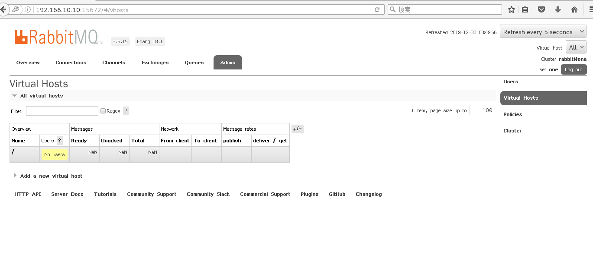

## Rabbitmq

消息队列：
AMQP协议：高级消息列队协议，应用于应用层，面向消息中间件设计的，它可以接受客户端的请求的消息，传递给后端的主机。
消息列队的应用
流量消峰     比如商品的秒杀
架构的解耦   开发
消息队列的种类
Redis：入队和出队的策略（先进先出）
MemcacheQ：多条列队   并发的性能比较好  完美的兼容memcache
MSMQ：支持大数据的  4M   只有发送和接收的功能
ZeroMQ：号称最快的消息列队   应用于金融方面比较多   高吞吐低延迟   
Kafka：支持快速的持久化    支持分布式  数据量大   高吞吐
ActiveMQ：java中间力量
Rabbitmq   开源的   最早   最稳定（重量级）  扩展性能比较差   消息封装比较大
RabbitMQ：
Rabbitmq   server	   消息列队服务，用于接收生产者产生的消息，并将消息分配给消费者
Producer    生产者  生产消息   消息分为两个部分   标签和数据   标签用于交换匹配
Consumer    消费者    用来消费列队分配的信息 处理完之后要给列队发送ack回应
消息ack机制：  用来判断哪些消息被消费了，如果检测到被消费了，那么这个消息就会被删除，如果所有的consumer没有消费，这个消息就会回转，再次等待消费
Connection   生产者和消费者与消息列队的tcp连接
Channel   虚拟通道   建立在tcp之上
Exchange   交换机   会根据自身的匹配规则交给合适的queue
Exchange的匹配规则：
Fanout     将生产者发送过来的消息交给所有的列队
Direct   进行精准匹配
Topic     进行模糊匹配
Queue   消息的载体   队列
Vhost    虚拟主机   一个rabbit server  有单独的队列和交换机   
集群模式：
普通模式：将生产者的消息放在单独的节点上
镜像模式：将生产者的消息存放在多个节点上
镜像模式的三个选项：
all：将产生的消息放在所有的节点上
Exactly：将产生的消息放在指定数量的节点上
Nodes：将产生的消息放在指定的节点上

rabbitmq的集群：

三台全做

[root@localhost ~]# rpm -ivh erlang-18.1-1.el7.centos.x86_64.rpm 

[root@localhost ~]# yum -y install socat

[root@localhost ~]# rpm -ivh rabbitmq-server-3.6.15-1.el7.noarch.rpm 

[root@localhost ~]# hostnamectl  set-hostname one  #192.168.10.10

[root@localhost ~]# hostnamectl  set-hostname two	#192.168.10.20

[root@localhost ~]# hostnamectl  set-hostname three  #192.168.10.30

[root@localhost ~]# vim /etc/hosts 

添加

192.168.10.10 one

192.168.10.20 two

192.168.10.30 three

[root@localhost ~]# scp /etc/hosts root@192.168.10.20:/etc/

[root@localhost ~]# scp /etc/host root@192.168.10.30:/etc/

三台都启动

```
[root@one ~]# systemctl stop firewalld
[root@one ~]# setenforce 0
[root@one ~]# systemctl start rabbitmq-server
[root@one ~]# rabbitmqctl cluster_status
Cluster status of node rabbit@one
[{nodes,[{disc,[rabbit@one]}]},
 {running_nodes,[rabbit@one]},
 {cluster_name,<<"rabbit@one">>},
 {partitions,[]},
 {alarms,[{rabbit@one,[]}]}]
 集群  erlang	cookie是一样的就是集群	查看第一台	更改后两台
[root@one ~]# cat /var/lib/rabbitmq/.erlang.cookie 
TIEEIMCVMOTZBXBYVAYM[root@one ~]# 
复制cookie值
后两台：
[root@two ~]# echo "TIEEIMCVMOTZBXBYVAYM" > /var/lib/rabbitmq/.erlang.cookie 
[root@two ~]# cat /var/lib/rabbitmq/.erlang.cookie 
TIEEIMCVMOTZBXBYVAYM
后端两台用电源重新启动
重启后两台
[root@two ~]# systemctl start rabbitmq-server
[root@two ~]# systemctl stop firewalld
[root@two ~]# setenforce 0
[root@two ~]# rabbitmqctl stop_app
[root@two ~]# rabbitmqctl join_cluster rabbit@one --ram
[root@two ~]# rabbitmqctl start_app
[root@two ~]# rabbitmqctl cluster_status

```

第一台上面

```
[root@one ~]# rabbitmq-plugins enable rabbitmq_management
[root@one ~]# rabbitmqctl delete_user guest
[root@one ~]# rabbitmqctl add_user one 123.com
[root@one ~]# rabbitmqctl set_user_tags one administrator

```

后两台上面

```
[root@two ~]# rabbitmq-plugins enable rabbitmq_management

```

```
[root@one ~]# firefox http://192.168.10.10:15672
one
123.com
```

添加虚拟主机

给haha虚拟主机设置权限

设定用户

添加策略

Name  策略名称   随便起

Pattern   匹配规则   默认所有的消息

Apply  to   直接绑定

Priority   优先级

Definition   all   复制给所有的节点

将策略和queue绑定

Virtual  host  虚拟主机

Name   选择策略的名称  

Durability   持久化

Node   数据的主节点

Auto  delete  自动删除不必要的消息

验证：  模拟发送一个消息

点击到首页

[root@one ~]# cd /var/lib/rabbitmq/mnesia/rabbit@one/queues/

[root@one queues]# ls

39NHM0Y1XCXX5WMAK7APKSM7B

[root@two ~]# cd /var/lib/rabbitmq/mnesia/rabbit@two/queues/

[root@two queues]# ls

39NHM0Y1XCXX5WMAK7APKSM7B



