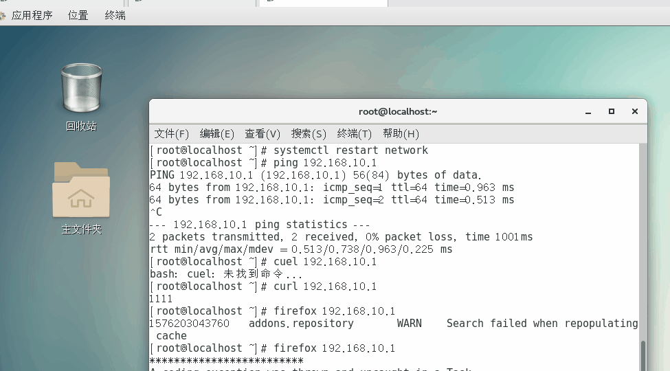
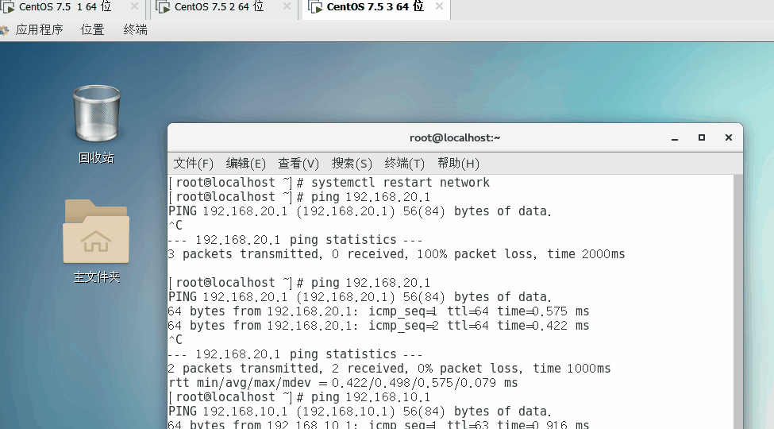

# squid代理服务器

代理  正向代理

​         反向代理

正向代理：传统代理

​                  透明代理

##  正向代理：

​			代理的是客户端，当客户端发送一个请求的时候，会先去代理服务器上寻找对应的资源，如果存在，则返回给客户端，如果不存在，则去后端获取，并缓存到本地，将数据返回给客户端

​	客户端访问的是server的ip	server端记录的是正向代理的ip

## 正向代理的优点：

1.访问外网

2.做缓存		缓存静态的数据，能够加速访问

3.保护客户端	对外隐藏信息

4.对客户端进行访问控制列表

## 传统代理：

需要客户端来去手动设置代理服务器，对于客户端而言，代理服务器不是透明的

## 透明代理:

代理服务器是透明的，相当于客户端和服务端的网关

客户端   192.168.10.3

代理服务器   192.168.10.2

server   192.168.10.1

## server端：

[root@localhost ~]# yum -y install httpd

[root@localhost ~]# echo 1111 > /var/www/html/index.html

[root@localhost ~]# systemctl restart httpd

[root@localhost ~]# curl 127.0.0.1
1111

## 代理端：

tar -zxvf squid-3.4.6.tar.gz -C /usr/src/

cd /usr/src/squid-3.4.6/

[root@localhost squid-3.4.6]# ./configure --prefix=/usr/local/squid --sysconfdir=/etc/ --enable-arp-acl --enable-linux-netfilter --enable-linux-tproxy --enable-async-io=100 --enable-err-language="Simplity-Chinese" --enable-underscro --enable-poll --enable-gnuregex

--prefix=/usr/local/squid 		

--sysconfdir=/etc/ 				#指定配置文件的路径

--enable-arp-acl 				#防止arp的攻击

--enable-linux-netfilter 		#启动内核过滤机制

--enable-linux-tproxy 		#启动透明代理功能

--enable-async-io=100 		#调整io的参数

--enable-err-language="Simplity-Chinese" 		#错误信息显示语言

--enable-underscro 			#允许使用下划线

--enable-poll 				#使用poll模型

--enable-gnuregex		#使用gnu的正则匹配

make   &&  make  install

ln  -s  /usr/lcoal/squid/sbin/*  /usr/local/sbin/

ln -s /usr/lcoal/squid/bin/*  /usr/local/bin/

useradd -M -s /sbin/nologin  squid

[root@localhost squid-3.4.6]# chmod -R  757  /usr/local/squid/var/

[root@localhost squid-3.4.6]# chown -R squid:squid  /usr/local/squid/var/

[root@localhost squid-3.4.6]# vim /etc/squid.conf

56 http_access allow all

启动squid

[root@localhost squid-3.4.6]# squid

[root@localhost squid-3.4.6]# netstat -anpt |grep squid
tcp6       0      0 :::3128                 :::*                    LISTEN      103730/(squid-1)    

三台都关防火墙

客户端：

打开火狐  --- 设置 ---  首选项 ---高级 --- 网络 ---- 设置 -----手动设置 ---- 代理服务器的IP端口  ---为所有协议使用 ---确定

[root@localhost ~]# curl 192.168.10.1

1111

一定使用firefox 访问  firefox  192.168.10.1

服务器监控日志

[root@localhost ~]# tail -f /var/log/httpd/access_log 

192.168.10.2 - - [13/Dec/2019:10:13:37 +0800] "GET / HTTP/1.1" 304 - "-" "Mozilla/5.0 (X11; Linux x86_64; rv:52.0) Gecko/20100101 Firefox/52.0"

查看到的是代理服务器的ip

## 透明代理

客户端 192.168.20.3   gw  192.168.20.1

代理端 两张网卡192.168.20.1      192.168.10.2

服务端  192.168.10.1  gw  192.168.10.2

代理

[root@localhost ~]# vim /etc/sysctl.conf 

net.ipv4.ip_forward = 1

[root@localhost ~]# sysctl -p
net.ipv4.ip_forward = 1

客户端

ping服务器的ip     ping  192.168.10.1

## 代理上

[root@localhost ~]# vim /etc/squid.conf

 59 http_port 192.168.20.1:3128  transparent

写和客户端指定的ip

多杀几次

[root@localhost ~]# killall  squid

[root@localhost ~]# killall  squid

[root@localhost ~]# killall  squid

squid: no process found

[root@localhost ~]# squid

[root@localhost ~]# netstat -anpt | grep squid

tcp        0      0 192.168.20.1:3128       0.0.0.0:*               LISTEN      107148/(squid-1)    

iptables设置端口转发

[root@localhost ~]# iptables -t nat -A PREROUTING -p tcp --dport=80 -s 192.168.20.0/24 -i ens37 -j REDIRECT --to 3128

192.168.20.0/24  客户端的网段

ens37   客户端网段的网卡名称

iptables -F  -t  nat  清空nat表的设置  （如果上面打错的话）

客户端：把原来设置的传统代理取消掉

把浏览器设置为原来的设置

验证：

客户端验证：

[root@localhost ~]# firefox http://192.168.10.1

服务端日志打开：

[root@localhost ~]# tail -f /var/log/httpd/access_log 

192.168.10.2 - - [13/Dec/2019:10:13:37 +0800] "GET / HTTP/1.1" 304 - "-" "Mozilla/5.0 (X11; Linux x86_64; rv:52.0) Gecko/20100101 Firefox/52.0" 

## 访问控制列表（正向和反向）

acl   列表名称	列表选项	列表内容

列表名称是唯一的

代理端

[root@localhost ~]# vim /etc/squid.conf

src  对于源地址的限制	对客户端的ip进行限制	可以是网段、也可以是ip

 26 acl qq src 192.168.20.3
 27 http_access deny qq

killall  squid  重启squid

squid

去客户端访问 firefox http://192.168.10.1

## dst	对目标地址进行限制

代理端

vim  /etc/squid.conf

acl qq dst 192.168.10.1

http_access deny qq

killall  squid  

squid

客户端访问  firefox  http://192.168.10.1

## dstdomain	对客户端访问的域名进行限制

代理端

vim  /etc/squid.conf

acl qq dstdomain www.kgc.com

http_access deny qq

killall  squid

squid

客户端

vim  /etc/hosts

192.168.168.10.1  www.kgc.com

访问 firefox  http://www.kgc.com

## port  对客户端的端口进行限制

代理端

vim /etc/squid.conf

acl qq port 80

http_access deny qq

去客户端访问  firefox  http://192.168.10.1:80

## time   对客户端访问的时间进行限制

S  周日  M 周一  T周二  W周三  H周四  F周五  A周六

D  M-F  周一到周五

代理端

vim  /etc/squid.conf

acl qq time MTW 08:30-12：30

http_access deny qq

客户端去访问 firefox http://192.168.10.1   在周一到周三8：30到12：80是拒绝访问的

## arp 对客户端的mac地址进行限制

代理端

vim  /etc/squid.conf

acl qq arp 00:0c:29:cd:95:6d
http_access deny qq

去客户端复制mac地址写到代理端http://192.168.10.1

去客户端访问 firefox  http://192.168.10.1

## url_regex  通过正则匹配对客户端的url进行限制

代理端

vim  /etc/squid.conf

acl qq url_regex kgc

http_access deny qq

客户端去访问  firefox http://www.kgc.com     