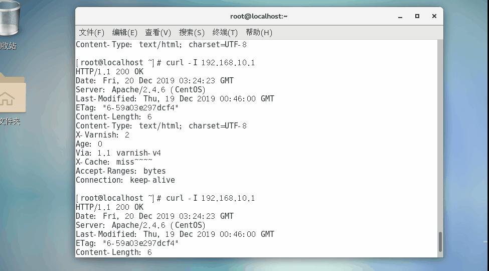
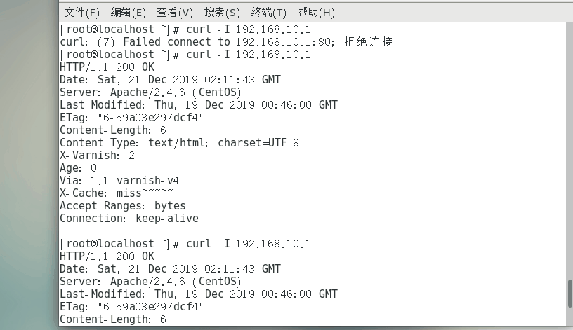
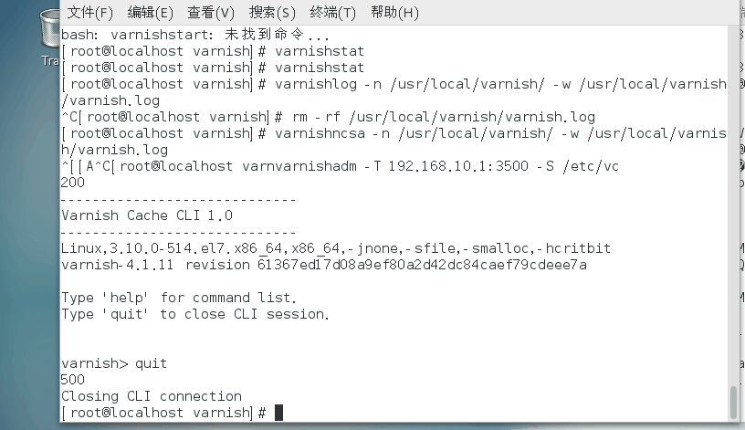

# 		varnish

# 反向代理

```
代理服务器代理的是服务端，当客户端发送一个请求的时候会先去代理服务器上寻找对应的资源，如果存在的话，将返回给客户端，如果没有，则代理服务器去后端获取并缓存到本地，把请求的数据返回给客户端
```

客户端访问的是反向代理的ip

## 反向代理的优点：

缓存	减轻后端服务器的压力

保护后端真实服务器的安全	防止ddos攻击

squid	正向代理

squid	反向代理

客户端	192.168.10.10

反向代理	192.168.10.1

服务端   	192.168.10.20	httpd  11111

## 代理端：

```
[root@localhost squid-3.4.6]# vim /etc/squid.conf
更改和添加
 56 http_access allow all
 59 #http_port 3128
 60 http_port 192.168.10.1:80 accel vhost vport
 61 cache_peer 192.168.10.20 parent 80 0 originserver name=web1
http_port 192.168.10.1:80	squid监听的端口
accel vhost 		允许客户端可以通过域名或者主机名来访问
vport		允许客户端通过ip或端口来访问
cache_peer 192.168.10.30 指定后端真实服务器
parent 代理服务器和后端服务器的层级关系
 0 	只有一个squid
 originserver	节点标识
 name=web1		别名
 
[root@localhost squid-3.4.6]# killall squid
[root@localhost squid-3.4.6]# 
[root@localhost squid-3.4.6]# killall squid
[root@localhost squid-3.4.6]# killall squid
squid: no process found
[root@localhost squid-3.4.6]# squid

```

客户端访问：

[root@localhost ~]# curl 192.168.10.1

11111

## CDN：内容分发网络	作为代理服务器	缓存静态的数据	可以解决不同地理区域的用户访问一个站点产生的高延迟，加快用户的访问速度，缓解服务器的压力

阿里云	腾讯云	亚马逊

对于电商平台	静态页面

视频网站	流媒体

游戏平台	安装包	补丁	更新包

移动平台	app安装包	更新的包

关闭squid   killall  squid

## varnish	高性能的http加速器

```
varnish	将数据缓存在内存总
linux内核	2.6以上	3台varnish的速度比12台squid的速度还要快
特点：	
1.数据缓存在内存中	支持虚拟内存	i/o性能比较好
2.数据需要持久化	断电	重启	数据会丢失（不重要的数据）
3.varnish支持精确到秒的缓存
4.防止ddos的攻击	1个varnish可以抗1Gddos攻击
5.支持vcl管理
```

## 负载均衡

调度算法	round_robin	动态轮询

fallback	选择一个工作正常的服务器

hash 	会话保持

random	随机

先托软件包


```
安装varnish
[root@localhost ~]# yum -y install automake autoconf libtool pkgconfig graphviz  ncurses-devel pcre-devel
[root@localhost ~]# rpm -ivh libedit-devel-3.0-12.20121213cvs.el7.x86_64.rpm
[root@localhost ~]# rpm -ivh jemalloc-devel-5.2.0-1.1.x86_64.rpm  --nodeps
[root@localhost ~]# rpm -ivh libedit-3.0-12.20121213cvs.el7.x86_64.rpm
[root@localhost ~]# rpm -ivh python-docutils-0.11-0.3.20130715svn7687.el7.noarch.rpm  --nodeps
[root@localhost ~]# rpm -ivh python-Sphinx-1.6.5-3.10.1.noarch.rpm --nodeps
[root@localhost ~]# tar -zxf varnish-4.1.11.tgz -C /usr/src/
[root@localhost ~]# cd /usr/src/varnish-4.1.11/
[root@localhost varnish-4.1.11]# ./configure --prefix=/usr/local/varnish && make && make install
[root@localhost varnish-4.1.11]# ln -s /usr/local/varnish/bin/* /usr/local/bin/
[root@localhost varnish-4.1.11]# ln -s /usr//local/varnish/sbin/* /usr/local/sbin/
[root@localhost varnish-4.1.11]# cp /usr/local/varnish/share/doc/varnish/example.vcl  /usr/local/varnish/default.vcl
```

简单的反向代理

[root@localhost varnish-4.1.11]# vim /usr/local/varnish/default.vcl

先不使用健康检测


```
 16 probe health {
 17       .url = "/";	#从/开始检测
 18       .timeout = 3s;	#超时时间
 19       .interval = 1s;	#间隔几秒钟访问一次
 20       .window = 5;		#能够维持5个窗口
 21       .threshold = 3;	#至少3个是成功的
 22 }
 23 backend default {		#后端主机的名称
 24     .host = "192.168.10.20";	#后端主机ip
 25     .port = "80";		#端口
 26     .probe = health;	#使用健康检查
 27 }
```

[root@localhost varnish-4.1.11]# varnishd -C -f /usr/local/varnish/default.vcl 	#检测

[root@localhost varnish-4.1.11]# varnishd  -f /usr/local/varnish/default.vcl	#启动

[root@localhost varnish-4.1.11]# varnishlog

```
[root@localhost varnish-4.1.11]# netstat -anput | grep varnish	
tcp        0      0 0.0.0.0:80              0.0.0.0:*               LISTEN      111443/varnishd     
tcp        0      0 127.0.0.1:45860         0.0.0.0:*               LISTEN      111443/varnishd     
tcp6       0      0 :::80                   :::*                    LISTEN      111443/varnishd     
tcp6       0      0 ::1:37588               :::*                    LISTEN      111443/varnishd     
```

web上打开日志

```
[root@localhost ~]# tail -f /var/log/httpd/access_log 
127.0.0.1 - - [19/Dec/2019:08:46:14 +0800] "GET / HTTP/1.1" 200 6 "-" "curl/7.29.0"
127.0.0.1 - - [19/Dec/2019:09:15:09 +0800] "GET / HTTP/1.1" 200 6 "-" "curl/7.29.0"
127.0.0.1 - - [19/Dec/2019:09:19:53 +0800] "GET / HTTP/1.1" 200 6 "-" "curl/7.29.0"
192.168.10.1 - - [19/Dec/2019:09:25:01 +0800] "GET / HTTP/1.1" 200 6 "-" "curl/7.29.0"
192.168.10.1 - - [19/Dec/2019:11:02:13 +0800] "GET / HTTP/1.1" 200 6 "-" "curl/7.29.0"
```


使用客户端访问 curl 192.168.10.1

```
[root@localhost ~]# curl 192.168.10.1
11111
[root@localhost ~]# curl 192.168.10.1
11111
```

## 负载均衡：

[root@localhost varnish-4.1.11]# vim /usr/local/varnish/default.vcl 

打开健康检查

```
 16 probe health {
 17       .url = "/";
 18       .timeout = 3s;
 19       .interval = 1s;
 20       .window = 5;
 21       .threshold = 3;
 22 }
 23 backend web1 {
 24     .host = "192.168.10.20";
 25     .port = "80";
 26     .probe = health;
 27 }
 28 backend web2 {
 29     .host = "192.168.10.30";
 30     .port = "80";
 31     .probe = health;
 32 }
 33 import directors;
 34 sub vcl_init {
 35      new back = directors.round_robin();
 36      back.add_backend(web1);
 37      back.add_backend(web2);
 38 }
 39 sub vcl_recv {
 40      set req.backend_hint = back.backend();
 41 }
import directors;	#导入集群模块
sub vcl_init {		#导入轮询模块
     new back = directors.round_robin();	#使用动态轮询
     back.add_backend(web1);	#后端的主机
     back.add_backend(web2);	
}
sub vcl_recv {
     set req.backend_hint = back.backend();	#会自动屏蔽掉后端不正常的服务器	需要健康检查
}
[root@localhost varnish-4.1.11]# varnishd -C -f /usr/local/varnish/default.vcl 
[root@localhost varnish-4.1.11]# killall varnishd
[root@localhost varnish-4.1.11]# varnishd  -f /usr/local/varnish/default.vcl
```

去客户端访问

```
[root@localhost ~]# curl 192.168.10.1
11111
[root@localhost ~]# curl 192.168.10.1
11111
```

关闭第一台服务器httpd

```
[root@localhost ~]# systemctl stop httpd
```

varnishd重新关闭并重启

```
[root@localhost varnish-4.1.11]# killall varnishd
[root@localhost varnish-4.1.11]# varnishd  -f /usr/local/varnish/default.vcl 
```

去客户端访问

```
[root@localhost ~]# curl 192.168.10.1
22222
[root@localhost ~]# curl 192.168.10.1
22222
[root@localhost ~]# curl 192.168.10.1
22222

```

## varnish的单主机实例

varnish vcl语言进行管理

vcl4.0	从varnish4版本开始	需要在配置文件中指定语言的版本

vcl语法格式

```
运算符
=	赋值运算符
==	!=	比较运算符
~	正则匹配
逻辑运算符
！	非
！ ~  不匹配
&& || 逻辑或
数据类型
字符串	使用  ""  例如"abc"
布尔值：
true  false 真假
有效时间	s 秒	 m分钟  d天
条件表达式  if  else
```

vcl的基本语法	固定模块

```
#健康检查的模块
16 probe health {	
 17       .url = "/";
 18       .timeout = 3s;
 19       .interval = 1s;
 20       .window = 5;
 21       .threshold = 3;
 22 }
 #定义后端主机的模块
23 backend default {		#后端主机的名称
 24     .host = "192.168.10.20";	#后端主机ip
 25     .port = "80";		#端口
 26     .probe = health;	#使用健康检查
 		.max_connections = 100; #最大连接量
 		.connect_timeout = 30s; #超时时间
  }
  #访问控制列表
  acl  acl_name {
  ip;   #ip
  domain_name;  #域名
  hostname;   #主机名
  }
  #集群负载均衡模块
import directors;	#导入集群模块
sub vcl_init {		#导入轮询模块
     new back = directors.round_robin();	#使用动态轮询
     new back = directors.fallback(); #找到第一个正常的服务器
     new back = directors.hash(); #对后端的地址进行hash
     new back = directors.random(); #随机
     back.add_backend(web1);	#后端的主机
     back.add_backend(web2);	
}
sub vcl_recv {
     set req.backend_hint = back.backend();	#会自动屏蔽掉后端不正常的服务器	需要健康检查
}
vcl_recv:用来接收处理用户的请求
vcl_hash:如果请求是静态数据，则去varnish本身的缓存中查找
vcl_pass:如果请求是动态数据，则直接去后端获取数据
vcl_pipe:不服个的请求直接返回错误页面
vcl_hit:本地上找到客户端请求的数据
vcl_miss:本地中没有找到客户端请求的数据
vcl_fetch（backend_response）	将请求的数据交给后端的节点
vcl_deliver：将响应交给客户端
```

预设变量：

```
req  客户端发送给varnish请求使用的变量 （req：requset请求）
req.url 客户端请求url
req.http	客户端请求头部信息
bereq:varnish向后端主机的请求（bereq:backend requset）
bereq.url  varnish请求url
bereq.http	varnish请求头部信息
resp varnish给客户端的响应（resp:response响应）
resp.http  :varnish相应头部的信息
resp.status :varnish的返回状态码
bereq   服务节点给varnish的响应（beresp backend response）
beresp.uncacheable :响应的数据是否不缓存
beresp.ttl :相应数据的缓存时间
obj  缓存在varnish中的数据
obj.ttl	varnish本地缓存时间
obj.hits:	varnish本地缓存命中的次数
hash_data()	对客户端的内容进行hash计算
hash_data(req.url)
hash_data(req.http.host)
hash_data(server.ip)
```

varnish 单主机实例

```
[root@localhost varnish-4.1.11]# vim /usr/local/varnish/default.vcl
probe health {
      .url = "/";
      .timeout = 3s;
      .interval = 1s;
      .window = 5;
      .threshold = 3;
}
backend web {
    .host = "192.168.10.20";
    .port = "80";
    .probe = health;
}
sub vcl_recv {
     set req.backend_hint = web;
        if (req.http.X-Forwarded-For){
                set req.http.X-Forwarded-For=req.http.X-Forwarded-For + "," +  client.ip;
         }
       else {
        set req.http.X-Forwarded-For=client.ip;
         }
if (req.method != "GET" &&
            req.method != "POST" &&
            req.method != "PUT" &&
            req.method != "HAED" &&
            req.method != "DELETE" 
          ){
                        return(pipe);
        }
if (req.url ~ "\.(html|htm|png|jpg$)"){
                return(hash);
        }
        if (req.url ~ "\.php$"){
                return(pass);
        }
        return(hash);
}
sub vcl_hash{
        hash_data(req.url);
                if(req.http.host){
                        hash_data(req.http.host);
                }
                else{
                        hash_data(server.ip);
                }
}
sub vcl_pass {
        return(fetch);
}
sub vcl_pipe {
        return(pipe);
}
sub vcl_hit {
        return(deliver);
}
sub vcl_miss {
        return(fetch);
}
sub vcl_backend_response {
        if(bereq.url ~ "\.php$"){
                set beresp.uncacheable = true;
                return(deliver);
        }
        if(bereq.url ~ "\.html$"){
                set beresp.ttl = 300s;
        }
        return (deliver);
}
sub vcl_deliver {
        if(obj.hits >0){
                set resp.http.X-Cache = "hit~~~";
        }
        else {
                set resp.http.X-Case = "miss~~~";
        }
        return(deliver);
}
[root@localhost varnish-4.1.11]# varnishd -C -f /usr/local/varnish/default.vcl
[root@localhost varnish-4.1.11]# killall varnishd
varnishd: no process found
[root@localhost varnish-4.1.11]# varnishd -f /usr/local/varnish/default.vcl 
```

客户端访问

curl -I  192.168.10.1

第一次为miss



## 多主机实例：

```
[root@localhost varnish-4.1.11]# vim /usr/local/varnish/default.vcl
probe health {
      .url = "/";
      .timeout = 3s;
      .interval = 1s;
      .window = 5;
      .threshold = 3;
}
backend web1 {
    .host = "192.168.10.20";
    .port = "80";
    .probe = health;
    .max_connections = 100;
}
backend web2 {
    .host = "192.168.10.30";
    .port = "80";
    .probe = health;
    .max_connections = 100;
}
acl allow {
        "127.0.0.1";
        "localhost";
        "192.168.0.1";
}
sub vcl_init{
        new back=directors.round_robin();
        back.add_backend(web1);
        back.add_backend(web2);
}
sub vcl_recv{
        if(req.method == "PURGE"){
                if(client.ip !~ allow ) {
                        return(synth(405,"not allowed"));
                }
                else{
                        return(purge);
                }
        }
        if(req.http.host ~ "^img"){
                set req.backend_hint = web1;
        }
        if(req.http.host ~ "^www"){
                set req.backend_hint = web2;
        }
        if(req.url ~ "\.(php|asp|aspx|jsp|do)($|\?)"){
                return(pass);
        }
        if(req.url ~ "\.(css|html|png|jpeg|htm)($|\?)"){
                return(hash);
        }
        if(req.method != "GET" &&
          req.method != "POST" &&
          req.method != "PUT" &&
          req.method != "DELETE" &&
          req.method != "HEAD"
           ){
                return(pipe);
        }
        if(req.method != "GET" && req.method != "HEAD"){
                return(pass);
        }
        if(req.http.Authorization){
                return(pass);
        }
        if(req.http.Accept-Enconding){
                if(req.url ~ "\.(png|gif|jpeg|gz|zip)"){
                        unset req.http.Accept-Enconding;
                }
                elseif(req.http.Accept-Enconding ~ "gzip"){
                        set req.http.Accept-Enconding = "gzip";
                }
                elseif(req.http.Accept-Enconding ~ "deflate"){
                        set req.http.Accept-Enconding = "deflate";
}
                else{
                        unset req.http.Accept-Enconding;
                }
        }
}
sub vcl_pipe{
        return(pipe);
}
sub vcl_pass{
        return(fetch);
}
sub vcl_hash{
        hash_data(req.url);
                if(req.http.host){
                        hash_data(req.http.host);
                }
                else{
                        hash_data(server.ip);
                        if(req.http.Accept-Enconding ~ "gzip"){
                        hash_data("gzip");
                        }
                        elseif(req.http.Accept-Enconding ~ "deflate"){
                        hash_data("deflate");
                        }
                }
}
sub vcl_hit{
        return(deliver);
}
sub vcl_miss{
        return(fetch);
}
sub vcl_backend_response{
        if(bereq.url ~ "\.(php|asp|jsp|do)($|\?)"){
                set beresp.uncacheable=true;
                return(deliver);
        }
        if(bereq.url ~ "\.(css|html|htm|jpg|png)($|\?)"){
                set beresp.ttl = 15m;
        }
        if(bereq.url ~ "\.(gz|bz2|zip|mp3|mp4)($|\?)"){
                set beresp.ttl =300s;
        }
                return(deliver);
}
sub vcl_purge{
        return(synth(200,"success~~~"));
}
sub vcl_deliver{
        if(obj.hits > 0){
                set resp.http.X-Cache = "hit~~~~~";
        }
        else{
                set resp.http.X-Cache = "miss~~~~~";
        }
        return(deliver);
}
varnish启动参数
varnishd：
   -f：指定varnish配置文件所在位置
   -a：指定varnish对后端服务节点监控使用的端口及IP
       -a 192.168.10.100:80
   -n：指定varnish工作目录
   -P：指定varnish服务运行时进程号存放文件
       -P  /usr/local/varnish/varnish.pid
   -s：指定varnish缓存数据的文件，文件所在地，缓存文件的大小
       -s file,/usr/local/varnish/cache.data,1G
   -T：定义远程管理varnish的主机及端口
       -T 192.168.10.100:3500
   -S：指定远程管理所需密钥所在位置
       -S /etc/vc
   -p：指定varnish运行时的参数
      -p thread_pools=2：指定varnish运行时开启的线程池的数量，跟CPU个数一致
      -p thread_pool_min=50：一个线程池中最少开启的线程数
      -p thread_pool_max=5000：一个线程池最大开启的线程数
      -p thread_pool_timeout=30：线程池等待连接超时时间，单位s，如果线程池中的开启的线程数量大于规定的最小值且30s内没有客户端的请求，则将超出最小值的线程释放掉
      -p  lru_interval=20：当缓存的数据没有设置缓存时间时，在20s内未被命中则释放掉该数据
```

[root@localhost varnish-4.1.11]# varnishd -C -f /usr/local/varnish/default.vcl

[root@localhost varnish-4.1.11]# killall varnishd

[root@localhost varnish-4.1.11]# varnishd  -f /usr/local/varnish/default.vcl

可以在varnish上清除缓存

[root@localhost ~]# curl -I http://192.168.2.1 -X PURGE

客户端访问：



## 远程管理varnish

```
[root@localhost varnish-4.1.11]# killall varnishd
[root@localhost varnish-4.1.11]# varnishd -a 192.168.10.1:80 -f  /usr/local/varnish/default.vcl  -n /usr/local/varnish  -P /usr/local/varnish/varnish.pid  -s  file,/usr/local/varnish/cache.data,1G  -T 192.168.10.1:3500  -S /etc/vc  -p thread_pools=2  -p thread_pool_min=50  -p thread_pool_max=1000  -p thread_pool_timeout=30 -p lru_interval=20
[root@localhost varnish-4.1.11]# varnishadm -T 192.168.10.1:3500 -S /etc/vc
varnish> ping
200        
PONG 1576897039 1.0

varnish> status
200        
Child in state running

varnish> stop
200        

start
varnish> 
200        

varnish> start
300        
Child in state running

varnish> backend.list
200        
Backend name                   Admin      Probe
boot.web1                      probe      Healthy 5/5
boot.web2                      probe      Healthy 5/5

```



```
varnish状态  参数
[root@localhost varnish-4.1.11]# cd /usr/local/varnish/
[root@localhost varnish]# cp _.vsm /usr/local/varnish/var/varnish/localhost.localdomain/_.vsm 
[root@localhost varnish]# varnishstat

```

varnishncsa用来简单查看日志

```
[root@localhost varnish]# varnishlog -n /usr/local/varnish/ -w /usr/local/varnish/varnish.log
客户端访问
[root@localhost ~]# curl -I 192.168.10.1
打开另一个终端会看但看不懂的日志
[root@localhost ~]# cat /usr/local/varnish/varnish.log 
使日志能看懂
[root@localhost varnish]# rm -rf /usr/local/varnish/varnish.log 
[root@localhost varnish]# varnishncsa -n /usr/local/varnish/ -w /usr/local/varnish/varnish.log
客户端访问
[root@localhost ~]# curl -I 192.168.10.1
varnish打开另一个终端
[root@localhost ~]# cat /usr/local/varnish/varnish.log 
192.168.10.10 - - [21/Dec/2019:11:08:05 +0800] "HEAD http://192.168.10.1/ HTTP/1.1" 200 0 "-" "curl/7.29.0"

```

